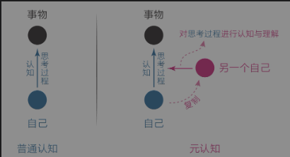
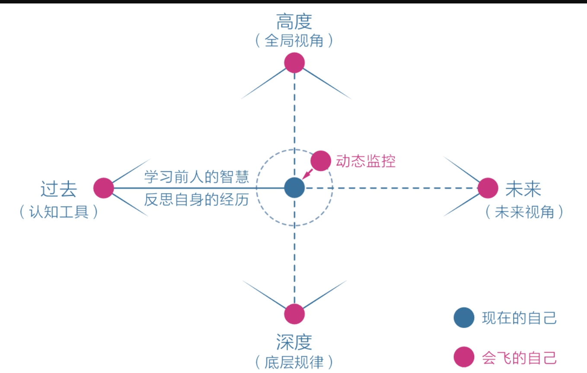
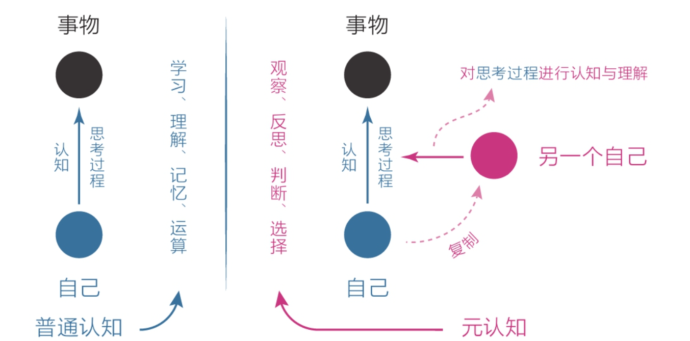

# 《认知觉醒》读后小结
## 1.大脑
### 1.1 本能
三种脑
- 本能脑
- 情绪脑
- 理智脑
理智脑最晚发育，也是最弱小最难占据主导地位的；但需要理智脑来驱动本能和情绪，而不是直接取代；
不要对抗，而是运用策略

### 1.2 焦虑
焦虑的5种类型
1. 完成焦虑：排太多的todo list，太多的ddl，
2. 定位焦虑：错误的定位让自己觉得一切都来不及了；别人家的孩子
3. 选择焦虑：选择太多，观点太多，噪音太多
4. 环境焦虑：外在环境的限制，导致我们可能无法去做想做的事情，也可能不得不去做一些不想做的事情
5. 难度焦虑：有些事情本身就是有很大难度的，不下决心死磕，而是始终在旁边打转，越拖越焦虑

焦虑的根源：想同时做很多事情，又想立刻看到效果
这一点是在大脑的生理结构中埋藏好的，人类的天性就是**避难趋易**和**急于求成**；\

没必要自责或愧疚，看清机理后酒可以设法改变，比如
1. 克制欲望，不要同时做很多事情
2. 面对现实，看清自己的实力
3. 要事有限，想办法只做最重要的事情
4. 接受环境，在局限中做力所能及的事情
5. 直面核心，逼自己去突破难事

但是上述答案，谁不懂？关键是如何真正提升能力和保持耐心的做到

### 1.3 耐心
要想有所成就，必须保持耐心，延迟满足。
首先我们要达成一个共识：缺乏耐心根本不是什么可耻的事，和自己的道德品质也全无关系，这仅仅是天生属性罢了，每个人都一样
但一般来说，社会中的精英通常是那些能更好地克服天性的人，他们的耐心水平更高，延迟满足的能力更强。

#### 1.3.1有什么规律可以帮助我们提高耐心呢？
1. 认知规律：
   1. 复利效应；前期增长缓慢，达到拐点后就会飞速增长
   2. 舒适区边缘：无论个体还是群体，其能力都以“舒适区—拉伸区—困难区”的形式分布，要告诉成长，就要始终处于舒适区边缘；但这个是反人性的
2. 把复利效应和舒适区边缘叠加
3. 对与微观来说，学习成长有一个比重，改变>行动>思考>学习；要正式这个权重；光学习没有用，还要做出改变
4. 还有就是平台期，学习是波浪上升的；5个月时间，常常是突破平台期的关键节点
   
#### 1.3.2那么怎么拥有耐心
1. 面对天性，坦然接受自己没有耐心
2. 卖你对诱惑，学会延迟满足，变对抗为沟通；想玩的时候，不要说不玩，而是说过会再玩；
3. 面对困难，主动改变视角，赋予行动意义。

## 2.潜意识
### 2.1 模糊
人生就是要消除模糊，学习就是为了消除模糊，**提升思考能力的方法正是不断明确核心困难和心得感悟，并专注于此。**

#### 2.1.1 拆除烦恼，消除情绪模糊
- 逃避真正的思考，就会让具体事件变模糊，其边界会一直扩大，在潜意识中变得难以解决；
- 但往往真正的困难比想象的要小的多
- 要积极地正视、拆解、看清困难，不给它变模糊的机会；一层一层挖下去，直到挖不动为止；坦然地承认、接纳难以启齿的想法，让情绪极度透明

#### 2.1.2 消除行动模糊
- 行动力不足的真正原因是选择模糊；当我们没有足够清晰的指令或者目标时，就很容易选择享乐，放弃那些本该坚持但比较烧脑的选项。
- 我们要把目标和过程细化、具体化，在诸多可能性中建立一条单行通道，让自己始终处于“没得选”的状态。

### 2.2 感性
感性包含了天性的部分、感性的部分；
高手学习的方法：**先用感性能力帮助自己选择，再用理性能力帮助自己思考。**

#### 2.2.1如何捕捉感性？
1. 最字法，关注最触动自己的点
2. 总字法，关注哪些总是挥之不去的念头、事情，去有意识地审视并消除它们
3. 无意识的第一反应
4. 梦境
5. 身体，身体不会说话，但是很诚实。生理或心理的不适，都会通过身体反映出来
6. 直觉

## 3元认知
元认知，就是最高级别的认知，它能对自身的“思考过程”进行认知和理解

元认知能力就是我们习以为常、见怪不怪的反思能力。主要可分为两类：
1. 被动元认知
2. 主动元认知

从被动到主动，这是一个转折点。当一个人能主动开启第三视角、开始持续反观自己的思维和行为时，就意味着他真正开始觉醒了，他有了快速成长的可能。

### 3.1元认知如何改变我们的命运
反观，是元认知的起点。当你开始反观自己的思考时，神奇的事情发生了：**你能意识到自己在想什么，进而意识到这些想法是否明智，再进一步纠正那些不明智的想法，最终做出更好的选择**

人生由无数个选择构成，尽量去做正确的。
想象自己身边有一个灵魂伴侣，时刻提醒你集中注意力、去做更重要的事；在你生气时梳理情绪等，时刻帮你从高处、深处、远处看待现在的自己，让自己保持清醒、不迷失，保持动力、不懈怠，保持平和、不冲动。有这样的能力加持，你会差吗？

### 3.2如何获取元认知？
- 第一，提升元认知能力的工具需要从“过去”端获取，包括学习前人的智慧和反思自身的经历。
  学习前人的智慧可以让我们拥有更广的全局视角（高度）​、掌握更深的底层规律（深度）​，帮我们从无知中跳出来，做出更加正确的选择。
- 第二，自身的经历更是一种独特的财富
- 第三，如果说学习和反思是静态的，那处于当下的、动态的自己又该如何主动运用元认知呢？很简单，启用你的“灵魂伴侣”啊！
  我们总是这样，一开始只想找一根绳子，最后却牵出一头大象。有时候你会沉迷于微博、头条、手游而无法自拔；有时候你会这里弄一下、那里弄一下，忙得一团糟，却不知道自己到底在忙什么；还有的时候，你会困在某种情绪之中，无端地消耗着自己……这些都是元认知能力不足的表现——顺着自己的本性做喜欢和舒服的事，精力发散，缺乏觉知，任何偶发的干扰都会分散注意力。
  
  如果有个“灵魂伴侣”一直在监控你，你就能审视自己的行为，从过程中跳出来，告诉自己：​“这个事情可做可不做，还是先忍一下，等做完重要的事情再说；停下来，先想清楚什么事情是最重要的，不能盲目地做那些容易但不重要的事；再过几年回头看，现在的烦恼不值一提，与其消耗自己，不如把情绪收起来，干点有用的事……”这种警醒和改变肯定不如保持现状舒服，但能够让你将注意力放到原来的目标上，去聚焦、去成长。

  元认知能力总能让你站在高处俯瞰全局，不会让你一头扎进生活的细节，迷失其中。如果你足够细心，还会发现未来视角总是当前行动的指南针，它可以在茫茫的生命中为你导航，让你主动选择去做那些更重要

- 第四，提高元认知能力的方法有很多，但最让人意想不到是下面这条——冥想。
  是的，冥想就是那种只要静坐在某处，然后放松身体，把注意力完全集中到呼吸和感受上的活动。
  冥想带来的极度专注可以帮大脑做健身操。通过持续锻炼，大脑可以直接从物理上提升人的元认知能力，如果过程中觉察到自己走神了，我们只需柔和地将注意力拉回来。现在再联系之前提到的“灵魂伴侣”​，不难发现这些活动本质上都在做同一件事：监控自己的注意力，然后将其集中到自己需要关注的地方。  

- 最后，必须要不断地练习、练习、再练习，慢慢就会又改变了。

### 3.3 自控力
元认知能力就是觉察力和自控力的组合。所以从实用角度讲，元认知能力可以被重新定义为：自我审视、主动控制，防止被潜意识左右的能力。

#### 3.3.1 我们天然被潜意识左右
很多人经常会在一天临近结束的时候发出灵魂拷问：**我这一天都干了什么？最重要的事情好像没做多少，乱七八糟的琐事却做了一大堆！当下幡然醒悟、痛下决心，提醒自己从明天开始一定要先做最重要的事，但是第二天又不知不觉地陷入了这种怪圈。这个时候，我们似乎依旧被潜意识支配，无法自控。**

#### 3.3.2 成长就是为了主动控制
随着我们不断长大，大脑的前额皮质开始发育，理智脑的战斗力才慢慢增强。不过理智脑的战斗力其实表现在两方面：一方面是侧重学习、理解、记忆、运算的认知能力，即我们在校学习时主要锻炼的部分，另一方面则是侧重观察、反思、判断、选择的元认知能力

我们需要主动、刻意锻炼自己的元认知能力。每当遇到需要选择的情况时，我们要是能先停留几秒思考一下，就有可能激活自己的理智脑，启用元认知来审视当前的思维，然后做出不一样的选择。
**比如，早上醒来时，如果能有几秒的时间用来思考，我们就可能在起床和看手机之间做出更好的选择；**

**所以一定要在选择节点上多花“元时间”​。**

#### 3.3.3 成为自己人生的思维舵手
“元时间”是我自创的概念。这是一个极好的概念，因为一天24小时看起来每分每秒都一样，但实际上并不相同，有些时间的权重要远远大于其他时间，我把这些权重大的时间叫作“元时间”​。
**元时间通常分布在“选择的节点”上，比如一件事情、一个阶段或一天开始或结束时。善用这些时间会极大程度地优化后续时间的质量。**换句话说，所有面临选择的时间节点，都可以被称作“元时间”​。我们不能在这个时候丧失主动权，任由本能左右自己进入下一个阶段，尤其是在面对诱惑或困难的时候。那么，在“元时间”内我们要做什么呢？很简单，就做一件事：想清楚。在选择的节点审视自己的第一反应，并产生清晰明确的主张。

1. **在选择的节点审视自己的第一反应，并产生清晰明确的主张。**元认知能力强的一个突出表现是：对模糊零容忍，也就是说想尽办法找出哪个最重要的、唯一的选择，让自己在元时间里只有一条路可以走。
2. 回想一下，**自己行动力弱的时候，脑子里对未来的具体行动肯定是模糊不清的。**在这个时候，最好的自救方法就是把所有想做的事情都列出来，进行排序，找出最重要的那件事，让脑子清醒。

综上所述，成为思维舵手有3种方法。
1. 针对当下的时间，保持觉知，审视第一反应，产生明确的主张；
2. 针对全天的日程，保持清醒，时刻明确下一步要做的事情
3. 针对长远的目标，保持思考，想清楚长远意义和内在动机。

元认知能力强的人，无论是当下的注意力、当天的日程安排，还是长期的人生目标，他们都力求想清楚意义、进行自我审视和主动控制，而不是随波逐流。

## 专注力
